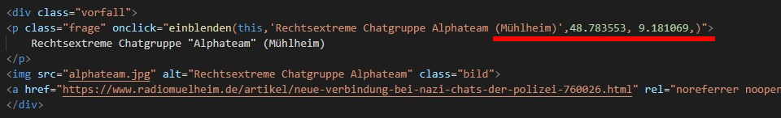

# Dokumentation des Prototype Enhancements

## 1. Alle Vorfälle mitKoordinaten versehen

Alle Vorfälle mit Koordinaten zu versehen damit Marker erzeugt werden können, ist wie die Recherche der ganzen Fälle, ein rießiger Zeitaufwand. Das Framework steht schon, es müss lediglich die Koordinaten der Orte in denen die Vorfölle passiert sind, recherchiert werden und Koordinaten doppelt genannter Orte ein wenig vershcoben werden, damit sie sich nicht überlagern.  

## 2. aufleuchtender Rahmen um die Map beim Erzeugen von Markern
Das temporäre Erzeugen eines Rahmens um die Map bei der MArkerezeugung ist relativ kompliziert umzusetzen. Dafür hat mir die Zeit nisher nicht gereicht. 
Ich werde mein Bestes geben, das ganez in der finalen Version noch zu implementieren. 

