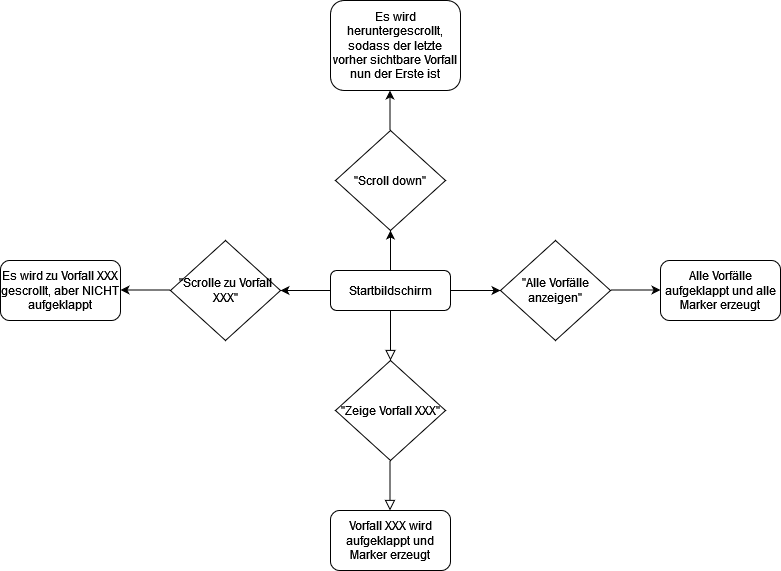

# Prototyping eines Voice User Interfaces

## KOnzeptentwurf

### Relevante Aspekte
Meinen GUI Prototyp als VUI umzusetzen fällt mir schwer, da ich mich von Anfang an auf das Klicken als Hauptinteraktion festgelegt habe. 
Relevant für einen Sprachassistenten wären das Klicekn der Vorfälle und das Scrollen auf der Webseite. Außerdem würde es Sinn machen, Nutzis eine Option zu bieten, mit der sie alle Vorfälle gleichzeitig aufklappen können und somit alle Marker auf einmal anzeigen lassen können. 

### Anwendungsszenario
Ein Szenario, in der ich mir die Nutzung eines Sprachassistenten in meinem Fall vorstellen kann, ist eine öffentliche Ausstellung, gerade jetzt, mitten in der Pandemie.
So könnten Nutzis mit dem GUI interagieren, ohne ihn anfassen zu müssen, was hygienischer ist, als wenn alle Nutzis eine Maus anfassen oder über einen Touchscreen den GUI bedienen.

### Low-Fid VUI

